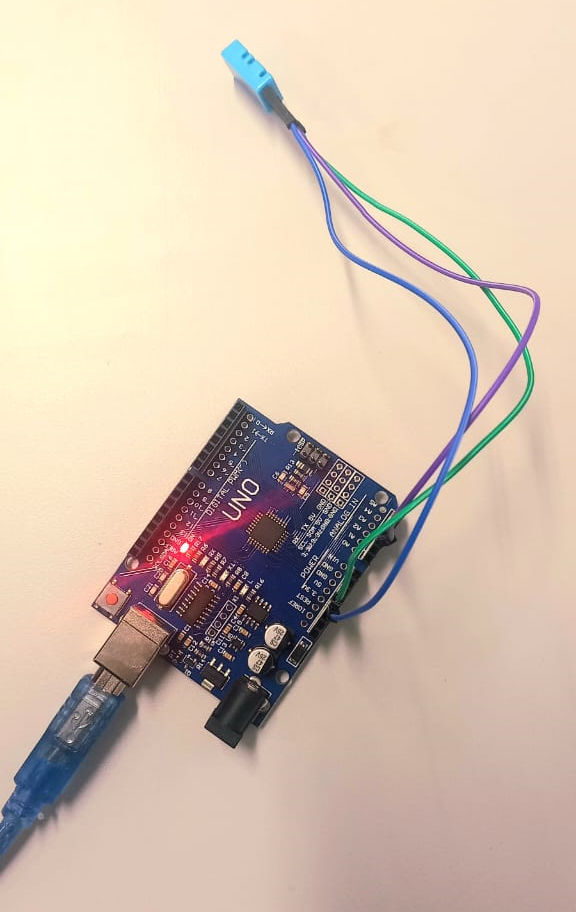

# Projeto Arduino: Sensor de umidade e temperatura
Esse projeto tem como foco a aplicação prática da medição de temperatura e umidade utiizando o sendor de umidade e temperatura DHT11 em conjunto com a plataforma microcontroladora Arduino.
A proposta básica é bastante simples, mas altamente educativa. Através dele, é possível criar um sistema que mede temperatura e umidade em tempo real, tendo os valores obtidos exibidos no monitor serial do ambiente de programação Arduino, proporcionando uma exepriência prática e informativa para quem deseja aprender mais sobre sensores e microcontroladores.

## Itens necessários:
Para a realização do projeto, serão necessários três componentes principais:
- 1 Arduino com cabo USB
- 1 Sensor de umidade e temperatura DHT11
- 3 Cabos jumper macho-fêmea

## Realização do projeto
A montagem do projeto foi bem simples, visto que é preciso apenas conectar o Sensor DHT11 no Arduino através dos cabos Jumper macho-fêmea. A imagem a seguir mostra o sistema montado:

## Conclusão
Com isso, concui-se que o o projeto em questão oferece uma solução prática e educativa para medir a temperatura e umidade em tempo real usando o sensor DHT11 e um Arduino. O código apresentado permite a leitura desses dados, que são exibidos no monitor serial. Além disso, o projeto tem potencial para aplicações avançadas. Em suma, esse projeto é um excelente ponto de partida para aprender sobre sensores e microcontroladores, oferecendo oportunidades de expansão e aplicação em diversos cenários.

## Melhorias
Por fim, vale destacar dois projetos práticos que podem ser realizados utilizando este pequeno sistema: estufas e jardinagem Inteligente, bem como projetos de automação residencial.
Imagine automatizar o ambiente de uma estufa ou jardim interno de forma inteligente. Com este sensor de umidade e temperatura, é possível monitorar e controlar as condições ambientais cruciais, como temperatura e umidade, para garantir o cultivo ideal de plantas. Isso significa que é possível criar um ambiente que seja perfeito para o crescimento de suas plantas, sem precisar monitorá-lo constantemente. 
Outra aplicação é a integração deste sensor em sistemas de automação residencial. Pode ser usado para controlar ventiladores, umidificadores, sistemas de irrigação e até persianas de acordo com as condições em seu ambiente. Isso não apenas aumenta o conforto em sua casa, mas também ajuda a economizar energia e tornar sua casa mais eficiente em termos de recursos.

